# 万修列阵 HTML Demo 需求规格

> **版本**：v1.1  
> **目标**：基于策划文档，用HTML技术构建可玩的国风Roguelike自动战斗Demo  
> **裁剪原则**：优先实现核心循环，合理裁剪非核心功能，确保Demo可玩性；单位、法宝和敌人保持完整数量不裁剪  
> **v1.1变更说明**：取消合成系统、新增单位折叠显示、修复招募唯一选择、新增待机区域

---

# 1. 组件定位

## 1.1 核心职责

本组件负责构建《万修列阵》的可玩HTML Demo，实现"随机开局→备战调整→自动战斗→奖励招募"的核心循环，验证游戏核心玩法的趣味性。

## 1.2 核心输入

1. 玩家的点击/拖拽操作指令（选择单位、选择战斗节点、商店购买等）
2. 游戏内置的单位属性数值表（完整版：27种我方单位+35种敌方单位）
3. 游戏内置的法宝数据表（完整版：213个法宝）
4. 游戏内置的关卡配置数据（Demo裁剪版：1章×20回合）

## 1.3 核心输出

1. 战斗场景的实时可视化渲染（单位移动、攻击动画、血条变化等）
2. 各界面的UI交互响应（备战界面、商店界面、战后结算等）
3. 游戏状态变更反馈（获得奖励、战斗胜负等）
4. 单局游戏结束时的战斗统计与结算展示

## 1.4 职责边界

1. 不负责局外成长与解锁系统（Demo无多局累积进度）
2. 不负责存档/读档功能（Demo为单次游玩）
3. 不负责多章节推进（Demo仅实现第一章"凡间"）
4. 不负责事件节点系统（Demo裁剪事件交互）
5. 不负责道具系统（Demo裁剪战前/战中道具使用）
6. 不负责音效/BGM系统（Demo为纯视觉版本，音效为可选扩展）
7. 不负责多难度层级（Demo仅提供"普通"难度）
8. 不负责合成系统（v1.1取消，单位不再通过合成升级）

---

# 2. 领域术语

**单位（Unit）**
: 参与战斗的个体，拥有HP、攻击、防御等属性。分为我方单位（玩家招募）和敌方单位（关卡生成）。

**等阶（Tier）**
: 单位的稀有度等级，分为普通（白）、稀少（绿）、传奇（紫）、神话（橙，限1个）。等阶决定属性倍数：普通×1.0、稀少×2.0、传奇×4.0、神话×8.0。

**阶数（Level）**
: 单位的等级，范围1阶。v1.1中取消合成系统，所有单位固定为1阶。

**法宝/遗物（Artifact）**
: 装备在单位上的增益物品，提供攻击、防御、暴击等属性加成或特殊效果。分为进攻类、防御类、功能类、特殊机制类。

**核心循环（Core Loop）**
: 游戏的循环推进流程：随机开局单位→备战(装备法宝/调整阵容)→选择战斗节点→自动战斗→战后结算(招募/法宝/金币)→返回备战→...→Boss战→章节结束。

**回合（Round）**
: 关卡中的单次战斗节点，每章包含20个回合。回合类型包括：普通战斗(14)、遗物战斗(3)、商店战斗(2)、Boss战(1)。

**备战界面（Preparation Screen）**
: 战斗间的准备阶段界面，玩家在此进行装备法宝、调整阵容、选择下一个战斗节点等操作。包含待机区域供单位展示。

**待机区域（Idle Area）**
: 备战界面中的展示区域，所有我方单位在其中待机展示，单位可在区域内自由随机行走，营造城镇/营地的氛围感。

**自动战斗（Auto Battle）**
: 双方单位从两侧冲锋交战，自动攻击范围内敌人、自动释放技能，玩家可调整倍速但不可直接操控单位。

**金币（Gold）**
: 游戏内主要货币，用于商店购买单位/法宝，通过战斗奖励获取。

**灵石（Spirit Stone）**
: 游戏内次要货币，用于开局重新随机等特殊操作。

**伤害公式（Damage Formula）**
: 伤害 = Max(1, (攻击方.攻击 - 防御方.防御 × 0.8) × 技能系数 × 随机波动(0.9-1.1) × 暴击倍数)。暴击时暴击倍数=暴击伤害倍数(默认2.0)，否则为1.0。

**流派（Archetype）**
: 基于单位类型和法宝组合形成的战斗风格，如战士流、法师流、坦克流、召唤流、辅助流、刺客流、控制流。

**复活倒计时（Revive Countdown）**
: 单位死亡后进入复活倒计时（默认4回合），倒计时期间无法参战，复活后恢复50%生命值。

**单位折叠显示（Unit Fold Display）**
: 当同种（相同名称+等阶）单位数量超过1个时，在单位列表中合并显示为"名称×N"格式（如"剑修弟子×3"），而非逐个单独显示，用于节省界面空间。

---

# 3. 角色与边界

## 3.1 核心角色

**玩家**
: 单人游玩者，负责在备战界面做出策略决策（装备法宝、购买、选择战斗节点），在战斗中可调整倍速。

## 3.2 外部系统

**浏览器运行环境**
: 提供HTML/CSS/JS执行环境，Demo作为纯前端单页应用运行。

## 3.3 交互上下文

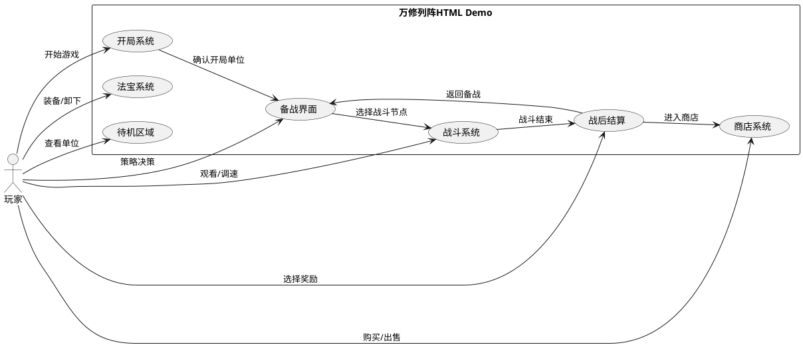

---

# 4. DFX约束

## 4.1 性能

1. 战斗场景渲染帧率应当不低于30fps
2. 单场战斗（普通战斗）时长应当控制在1-2分钟
3. 单场Boss战时长应当控制在3-5分钟
4. 界面切换响应时间应当不超过500ms
5. 单位数量上限为20个我方单位，超过时禁止招募
6. 待机区域内单位随机行走动画应当流畅，帧率不低于30fps

## 4.2 可靠性

1. 游戏状态不一致时（如单位属性异常），应当自动修正为最近合法状态
2. 战斗中发生异常时，应当允许玩家返回备战界面而非卡死

## 4.3 安全性

1. 本Demo为纯前端单机应用，不涉及用户数据存储和网络通信

## 4.4 可维护性

1. 游戏数据（单位属性、法宝效果、关卡配置）应当与游戏逻辑代码分离，便于后续调整数值
2. 核心战斗公式应当可配置（防御系数、随机波动范围等）

## 4.5 兼容性

1. 应当支持主流现代浏览器（Chrome 90+、Edge 90+、Firefox 90+、Safari 15+）
2. 应当支持1280×720及以上分辨率显示
3. 应当同时支持鼠标点击和触摸操作（移动端适配）

---

# 5. 核心能力

## 5.1 开局系统

### 5.1.1 业务规则

1. **开局单位生成规则**：当玩家点击"开始游戏"时，系统应当从已定义的全部27种我方单位池中随机选择1个单位作为开局单位，等阶概率为：普通60%、稀少30%、传奇10%。

   a. 验收条件：[玩家点击"开始游戏"] → [系统展示1个随机等阶的开局单位，等阶分布符合60%/30%/10%概率]

2. **开局单位属性规则**：开局单位的属性应当为该等阶标准属性的80%。

   a. 验收条件：[开局单位为普通等阶琴修弟子，标准攻击=15] → [开局攻击=12（15×80%取整）]

3. **重新随机规则**：玩家可消耗100灵石重新随机开局单位，每局限3次。

   a. 验收条件：[玩家点击"再测天机"且剩余次数>0且灵石≥100] → [消耗100灵石，重新生成1个随机单位，剩余次数-1]
   
   b. 验收条件：[玩家点击"再测天机"且剩余次数=0] → [按钮显示为禁用状态，提示"天机已尽，无法再测了"]
   
   c. 验收条件：[玩家点击"再测天机"且灵石<100] → [按钮显示为禁用状态，提示"囊中羞涩，先去赚点盘缠吧"]

4. **开局初始资源**：玩家开局应当拥有200灵石和0金币。

   a. 验收条件：[新游戏开始] → [灵石=200，金币=0]

### 5.1.2 交互流程

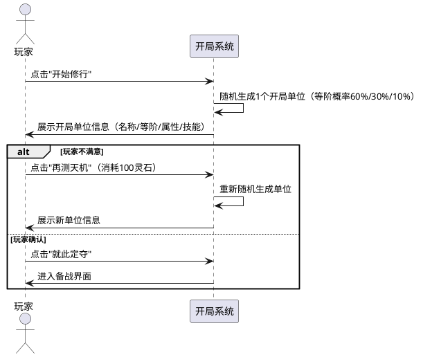

### 5.1.3 异常场景

1. **单位池为空**

   a. 触发条件：我方单位数据表未加载或为空
   
   b. 系统行为：使用内置的默认单位数据（琴修弟子-普通等阶）作为兜底
   
   c. 用户感知：正常展示开局单位，无异常提示

---

## 5.2 备战界面

### 5.2.1 业务规则

1. **界面信息展示规则**：备战界面应当常驻展示以下信息：关卡进度条（当前回合/总回合）、我方单位列表、已拥有法宝列表、金币/灵石数量、可用战斗节点列表、待机区域。

   a. 验收条件：[玩家进入备战界面] → [界面同时显示关卡进度、单位列表、法宝列表、资源数量、战斗节点、待机区域]

2. **单位详情查看规则**：当玩家悬停（或点击）某个单位时，系统应当展示该单位的详细信息：名称、等阶、类型/流派、全部属性值、已装备法宝、技能描述。

   a. 验收条件：[玩家悬停单位"剑修弟子"] → [弹出浮窗显示：剑修弟子/稀少(绿)/战士流/攻击64/防御36/.../技能:剑气斩]

3. **法宝详情查看规则**：当玩家悬停某个法宝时，系统应当展示法宝详细信息：名称、品质、类型、效果描述。

   a. 验收条件：[玩家悬停法宝"番天印"] → [弹出浮窗显示：番天印/传奇(紫)/进攻类/攻击时20%概率造成范围伤害(攻击力150%)]

4. **战斗节点选择规则**：当玩家点击某个战斗节点时，系统应当展示该节点的类型和预估难度，玩家确认后进入战斗。

   a. 验收条件：[玩家点击"遗物战斗"节点] → [弹出确认信息：节点类型=遗物战斗，预估难度=中等，确认后进入战斗]

5. **关卡进度规则**：每章包含20个回合，回合类型分配为：回合1-4普通、回合5遗物、回合6-9普通、回合10商店、回合11-13普通、回合14遗物、回合15-16普通、回合17商店、回合18-19普通、回合20Boss。

   a. 验收条件：[玩家在回合5选择战斗] → [战斗节点类型为"遗物战斗"]

6. **死亡单位显示规则**：已死亡但处于复活倒计时的单位，应当显示为灰色头像+倒计时回合数，且无法参战。

   a. 验收条件：[单位"剑修弟子"死亡，复活倒计时=3] → [备战界面显示灰色头像+"3回合后复活"]

### 5.2.2 交互流程

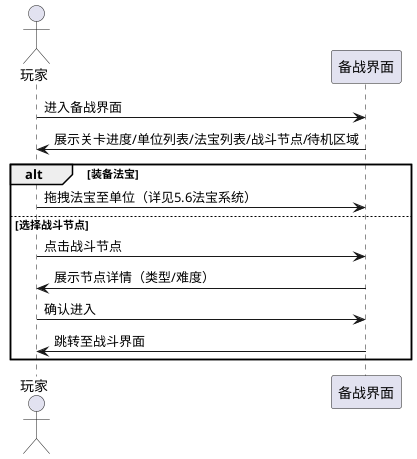

### 5.2.3 异常场景

1. **全部单位死亡**

   a. 触发条件：所有我方单位均已阵亡且无复活可能
   
   b. 系统行为：显示游戏失败界面，提示"修行失败，重整旗鼓再开局"
   
   c. 用户感知：弹出失败界面，提供"重新开始"按钮

2. **无可选战斗节点**

   a. 触发条件：当前章节所有回合已完成
   
   b. 系统行为：触发章节结算流程（Demo中为游戏通关）
   
   c. 用户感知：显示通关界面

---

## 5.3 待机区域

### 5.3.1 业务规则

1. **待机区域存在规则**：备战界面应当包含一个待机区域（Idle Area），所有存活的和复活倒计时中的我方单位应当在待机区域内展示。

   a. 验收条件：[玩家进入备战界面] → [待机区域可见，其中展示所有我方单位的形象]

2. **待机区域位置规则**：待机区域应当位于备战界面的中央/主展示区域，作为备战界面的核心视觉焦点。

   a. 验收条件：[查看备战界面布局] → [待机区域占据界面中央主要空间]

3. **单位随机行走规则**：待机区域内的单位应当进行自由随机行走，模拟城镇/营地的闲逛感。单位在区域内随机选择目标点，以自身移速向目标点移动，到达后短暂停留，再选择新的随机目标点。

   a. 验收条件：[玩家在备战界面观察待机区域] → [单位在区域内持续进行随机行走，不是静止不动]

4. **行走边界约束规则**：单位的随机行走应当被限制在待机区域的边界内，不可走出待机区域。

   a. 验收条件：[单位到达待机区域边缘] → [单位不超出待机区域边界，转向区域内新的目标点]

5. **行走避让规则**：单位行走时应当简单避让其他单位，避免完全重叠。当两个单位距离过近时，应当互相偏移以保持可见间距。

   a. 验收条件：[两个单位随机行走到同一位置附近] → [两者之间保持一定间距，不出现完全重叠]

6. **死亡单位待机展示规则**：处于复活倒计时的死亡单位应当在待机区域内展示，但应使用灰色/半透明形象，并显示复活倒计时，且不进行随机行走。

   a. 验收条件：[单位"剑修弟子"死亡，复活倒计时=2] → [待机区域中显示半透明/灰色的剑修弟子形象+倒计时"2"，不进行随机行走]

7. **待机区域单位点击规则**：当玩家点击待机区域中的单位时，应当弹出该单位的详情浮窗（与备战界面单位列表中悬停查看一致的详情）。

   a. 验收条件：[玩家点击待机区域中的"石工傀儡"] → [弹出石工傀儡的详细信息浮窗]

8. **待机区域与单位列表联动规则**：待机区域中的单位与备战界面左侧的单位列表应当保持同步，新增或移除单位时两边同时更新。

   a. 验收条件：[战后招募1个新单位] → [待机区域和单位列表同时新增该单位]

### 5.3.2 交互流程

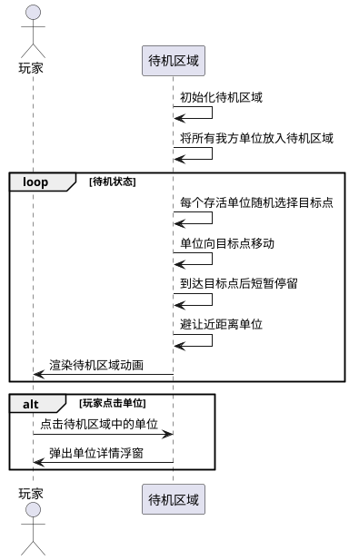

### 5.3.3 异常场景

1. **待机区域单位过多**

   a. 触发条件：我方单位数量较多（如接近20个），待机区域空间不足
   
   b. 系统行为：缩小单位形象尺寸或增加待机区域滚动，确保所有单位可见
   
   c. 用户感知：单位形象变小但仍可辨识和点击查看

2. **待机区域单位全部死亡**

   a. 触发条件：所有我方单位均已阵亡
   
   b. 系统行为：待机区域显示空旷/灰暗状态，触发游戏失败流程
   
   c. 用户感知：待机区域空旷，弹出失败界面

---

## 5.4 单位折叠显示

### 5.4.1 业务规则

1. **同种单位折叠规则**：当单位列表中存在多个相同名称+相同等阶的单位时，应当合并显示为"名称×N"格式（N为该种单位的数量），而非逐个单独显示。

   a. 验收条件：[玩家拥有3个稀少等阶剑修弟子] → [单位列表中显示"剑修弟子×3"，而非3个独立的"剑修弟子"]

2. **折叠展开规则**：当玩家点击折叠显示的"名称×N"条目时，应当展开显示该种单位的每个实例（含各自的法宝装备、生命值等个体信息），再次点击则收起折叠。

   a. 验收条件：[玩家点击"剑修弟子×3"] → [展开显示3个剑修弟子的个体信息；再次点击则收起为"剑修弟子×3"]

3. **折叠显示适用范围**：单位折叠显示应当在所有展示单位列表的界面生效，包括：备战界面单位列表、战后结算界面单位统计、待机区域（待机区域以形象展示为主，折叠仅在左侧列表生效）。

   a. 验收条件：[战后结算界面展示参战单位] → [同种单位合并显示为"名称×N"格式]

4. **折叠后操作规则**：折叠状态下，当玩家为该种单位装备法宝时，系统应当提示选择具体哪个实例进行装备。若该种单位仅1个则直接装备。

   a. 验收条件：[玩家拖拽法宝至"剑修弟子×3"] → [弹出选择面板，让玩家选择装备给哪个剑修弟子实例]

   b. 验收条件：[玩家拖拽法宝至"石工傀儡×1"] → [直接装备给该石工傀儡，无需选择]

5. **不同等阶不折叠规则**：相同名称但不同等阶的单位不应当折叠在一起，应分别显示。

   a. 验收条件：[玩家拥有2个普通等阶琴修弟子和1个稀少等阶琴修弟子] → [单位列表分别显示"琴修弟子(白)×2"和"琴修弟子(绿)×1"]

6. **单例不折叠规则**：当某种单位仅1个时，无需折叠，直接显示原始单位信息。

   a. 验收条件：[玩家拥有1个稀少等阶剑修弟子] → [单位列表显示"剑修弟子"（不显示×1）]

### 5.4.2 交互流程

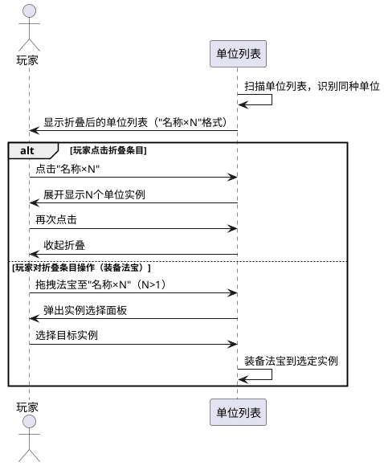

### 5.4.3 异常场景

1. **折叠条目中所有实例均已死亡**

   a. 触发条件：某种单位所有实例均处于复活倒计时
   
   b. 系统行为：折叠条目整体显示为灰色+"×N"，点击展开后每个实例显示各自的倒计时
   
   c. 用户感知：折叠条目灰色，展开后可查看每个实例的复活进度

---

## 5.5 自动战斗系统

### 5.5.1 业务规则

1. **战斗初始化规则**：当战斗开始时，我方单位从战场左侧出发，敌方单位从战场右侧出发，双方自动向对方冲锋。

   a. 验收条件：[玩家确认进入普通战斗] → [我方单位在左侧列阵，敌方单位在右侧列阵，随后自动冲锋]

2. **自动攻击规则**：单位应当自动攻击其攻击范围内最近的敌人，攻击间隔由攻速属性决定（如攻速1.2秒则每1.2秒攻击一次）。

   a. 验收条件：[单位攻速=1.2秒，进入攻击范围] → [该单位每1.2秒对最近敌人发起1次攻击]

3. **伤害计算规则**：每次攻击的伤害应当按公式计算：伤害 = Max(1, (攻击方.攻击 - 防御方.防御 × 0.8) × 技能系数 × 随机波动(0.9~1.1) × 暴击倍数)。

   a. 验收条件：[攻击方攻击=30，防御方防御=10，技能系数=1.0，未暴击，随机波动=1.0] → [伤害=Max(1,(30-10×0.8)×1.0×1.0×1.0)=Max(1,22)=22]

4. **暴击规则**：每次攻击时，若随机值 < 攻击方.暴击率 - 防御方.韧性×0.01，则触发暴击，伤害×暴击伤害倍数（默认2.0）。

   a. 验收条件：[攻击方暴击率=0.15，防御方韧性=50，随机值=0.05] → [0.05 < 0.15-0.50×0.01=0.10，触发暴击，伤害×2.0]
   
   b. 验收条件：[攻击方暴击率=0.05，防御方韧性=50] → [最终暴击率=0.05-0.50×0.01=0.00，永不暴击]

5. **闪避规则**：若随机值 < 防御方.闪避率，则攻击被闪避，伤害=0，显示"MISS"。

   a. 验收条件：[防御方闪避率=0.20，随机值=0.15] → [攻击被闪避，显示"MISS"，伤害=0]

6. **击杀规则**：当单位HP降为0或以下时，该单位应当从战场移除并标记为死亡。

   a. 验收条件：[单位HP=5，受到伤害=10] → [HP降为0，单位从战场消失，标记为死亡]

7. **战斗胜利条件**：当所有敌方单位被消灭时，我方获胜。

   a. 验收条件：[最后一个敌方单位HP降为0] → [显示"战斗胜利"，进入战后结算]

8. **战斗失败条件**：当所有我方单位被消灭时，我方失败。

   a. 验收条件：[最后一个我方单位HP降为0] → [显示"战斗失败"，提供"重新开始"选项]

9. **战斗倍速规则**：玩家可以在战斗中切换倍速（0.5x / 1.0x / 1.5x），倍速应当同时影响所有单位的移动速度和攻击间隔。

   a. 验收条件：[玩家切换至1.5x倍速] → [所有单位移速×1.5，攻击间隔÷1.5]

10. **战斗暂停规则**：当玩家点击暂停时，战斗应当完全暂停，弹出暂停菜单（继续/重新开始/返回备战）。

    a. 验收条件：[玩家点击暂停] → [战斗完全停止，弹出暂停菜单]

11. **敌方单位生成规则**：敌方单位应当从全部35种敌方单位池中根据当前回合号和章节号生成，数量=5+floor(回合号/5)+随机(-1~2)，属性需应用难度倍数。

    a. 验收条件：[第5回合普通战斗] → [敌方数量=5+1+随机(-1~2)=5~8个，属性应用回合内难度倍数1.0~1.1]

12. **Boss战生成规则**：第20回合为Boss战，应当生成1个Boss单位+10~15个小兵。

    a. 验收条件：[第20回合Boss战] → [生成1个Boss + 10~15个小兵]

13. **近战/远程行为规则**：近战单位（射程=0）应当移动到目标身旁攻击；远程单位（射程>0）应当移动到射程范围内后停止并攻击。

    a. 验收条件：[远程单位射程=300，距敌人200像素] → [单位在当前位置直接攻击，不继续靠近]

### 5.5.2 交互流程

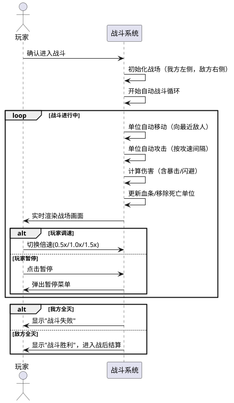

### 5.5.3 异常场景

1. **战斗超时**

   a. 触发条件：战斗持续超过10分钟仍未结束
   
   b. 系统行为：弹出提示"战斗时间过长，是否继续？"
   
   c. 用户感知：可选择"继续战斗"或"放弃本次战斗"

2. **单位卡位**

   a. 触发条件：单位移动路径被完全阻挡无法到达任何敌人
   
   b. 系统行为：单位尝试绕行或原地攻击最近可达敌人
   
   c. 用户感知：单位可能轻微位移后开始攻击

---

## 5.6 战后结算系统

### 5.6.1 业务规则

1. **战斗结果展示规则**：战斗结束后，系统应当展示战斗结果（胜利/失败），胜利时高亮金色，失败时灰色。

   a. 验收条件：[我方获胜] → [显示金色"战斗胜利"文字]
   
   b. 验收条件：[我方失败] → [显示灰色"战斗失败"文字]

2. **金币奖励规则**：战斗胜利后，系统应当根据回合类型发放金币。普通战斗50-100金币、遗物战斗80-120金币、商店战斗100-150金币、Boss战300-500金币。

   a. 验收条件：[普通战斗胜利] → [获得50~100金币（随机）]

3. **单位招募规则**：战斗胜利后，系统应当从全部27种我方单位池中随机生成3个单位供玩家选择1个招募。单位等阶概率：普通60%、稀少30%、传奇10%。玩家选择1个后，其余2个选项应当立即消失/禁用，不可再次选择。

   a. 验收条件：[战斗胜利进入结算] → [展示3个随机单位供选择]

   b. 验收条件：[玩家从3个招募选项中选择1个] → [选中单位加入队伍，其余2个选项立即消失/禁用，不可再点击选择]

   c. 验收条件：[玩家已选择1个招募单位后点击其他选项] → [无效操作，其他选项已不可选]

4. **遗物战斗法宝获取规则**：当回合类型为"遗物战斗"且战斗胜利时，系统应当额外给予1个随机法宝。品质概率：普通60%、稀少30%、传奇10%。

   a. 验收条件：[遗物战斗胜利] → [获得1个随机品质法宝（60%普通/30%稀少/10%传奇）]

5. **Boss战特殊奖励规则**：Boss战胜利后，除常规奖励外，系统应当给予1个传奇品质法宝和1个传奇等阶单位招募选项。

   a. 验收条件：[Boss战胜利] → [获得300~500金币 + 1个传奇法宝 + 3选1招募（含1个保底传奇单位）]

6. **单位表现统计规则**：结算界面应当展示各单位的表现统计：伤害排名、承伤排名、治疗排名、存活状态。同种单位应当使用折叠显示（"名称×N"格式）。

   a. 验收条件：[战斗胜利进入结算] → [展示每个参战单位的伤害/承伤/治疗数值和排名，同种单位折叠显示]

7. **死亡单位复活倒计时规则**：战斗中死亡的单位，战后复活倒计时减少1回合。倒计时为0时单位复活，恢复50%生命值。

   a. 验收条件：[单位复活倒计时=1，战斗胜利] → [倒计时减为0，单位复活，HP=50%最大生命值]

8. **队伍上限规则**：我方单位数量上限为20个，达到上限时不可再招募新单位。

   a. 验收条件：[我方已有20个单位，战后招募] → [提示"队伍已满，先送几个回去休息吧"，仍可选择放弃招募]

### 5.6.2 交互流程

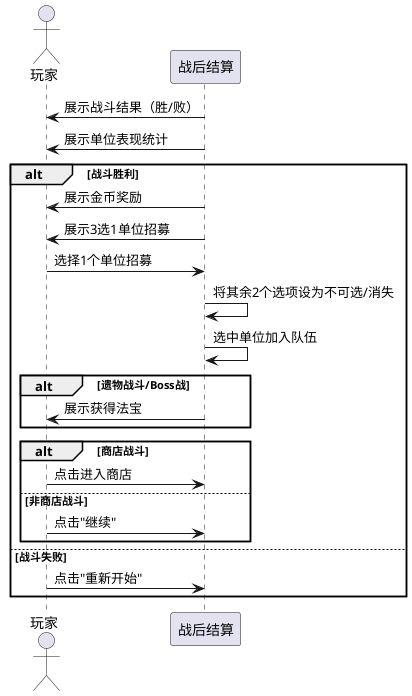

### 5.6.3 异常场景

1. **招募时队伍已满**

   a. 触发条件：我方单位已满20个，战后招募环节
   
   b. 系统行为：允许玩家选择"替换"（选择1个现有单位移除以腾出位置）或"放弃"招募
   
   c. 用户感知：提示"队伍已满，是否替换现有单位？"

2. **招募重复点击Bug修复**

   a. 触发条件：玩家在3选1招募界面已选择1个单位后，再次点击其他招募选项
   
   b. 系统行为：忽略操作，其余选项已被设为不可选状态
   
   c. 用户感知：其余选项灰显/消失，无法再次点击

---

## 5.7 法宝系统

### 5.7.1 业务规则

1. **法宝装备规则**：当玩家将法宝拖拽至某单位时，系统应当将该法宝装备到该单位上，法宝的属性加成立即生效。

   a. 验收条件：[玩家将"八卦紫绶衣"装备到"石工傀儡"] → [石工傀儡获得"减少受到伤害20%"和"增加韧性15%"效果]

2. **法宝卸下规则**：当玩家从单位上卸下法宝时，该法宝的加成效果应当立即移除，法宝返回玩家的法宝背包。

   a. 验收条件：[玩家卸下"八卦紫绶衣"] → [对应单位失去该法宝加成，法宝回到背包]

3. **法宝品质与属性对应规则**：法宝品质分为普通（白）、稀少（绿）、传奇（紫）、神话（橙），品质越高效果越强。

   a. 验收条件：[查看"金刚圈"（稀少/绿）] → [效果"增加防御30%，攻速-10%"]

4. **法宝获取途径规则**：法宝可通过以下途径获取：遗物战斗必得、Boss战奖励、商店购买、普通战斗5%概率掉落。全部213个法宝均可在对应获取途径中出现。

   a. 验收条件：[普通战斗胜利] → [5%概率额外获得1个普通品质法宝]

5. **法宝完整实现规则**：Demo版本应当实现全部213个法宝，覆盖四大类型（进攻/防御/功能/特殊机制）和四个品质等级（普通/稀少/传奇/神话）。

   a. 验收条件：[Demo法宝总数] → [213个，涵盖进攻/防御/功能/特殊机制四类，品质覆盖白/绿/紫/橙]

6. **法宝效果应用规则**：法宝效果应当在计算属性时实时应用。进攻类增加攻击/暴击/攻速，防御类增加防御/韧性/生命，功能类提供特殊功能（如复活/召唤），特殊机制类改变战斗机制。

   a. 验收条件：[单位装备进攻类法宝"番天印"] → [该单位攻击时有20%概率造成范围伤害(攻击力150%)]

### 5.7.2 交互流程

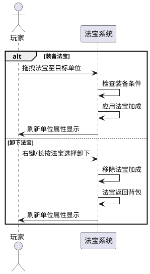

### 5.7.3 异常场景

1. **法宝效果冲突**

   a. 触发条件：两个法宝提供互斥的效果（如一个增加攻速一个减少攻速）
   
   b. 系统行为：两个效果独立叠加计算（如+30%攻速-10%攻速=+20%攻速）
   
   c. 用户感知：属性面板显示最终叠加结果

---

## 5.8 商店系统

### 5.8.1 业务规则

1. **商店进入规则**：当回合类型为"商店战斗"且战斗胜利后，系统应当自动进入商店界面。

   a. 验收条件：[第10回合商店战斗胜利] → [自动进入商店界面]

2. **商品刷新规则**：商店应当从全部27种我方单位池和213个法宝池中随机刷新3-5个商品，商品类型包括：单位（1-3个）、法宝（1-2个）。

   a. 验收条件：[进入商店] → [展示3~5个随机商品（含单位和法宝）]

3. **商品价格规则**：单位价格：普通100金币、稀少300金币、传奇1000金币；法宝价格：普通150-250金币、稀少300-500金币、传奇500-1000金币、神话1500金币。

   a. 验收条件：[商店刷新1个稀少等阶单位] → [价格=300金币]

4. **购买规则**：当玩家金币≥商品价格时，可以购买商品，购买后金币扣除相应价格，商品加入玩家队伍/背包。

   a. 验收条件：[玩家金币=500，购买稀少单位(300金币)] → [金币变为200，单位加入队伍]

5. **金币不足拒绝规则**：当玩家金币<商品价格时，购买按钮应当为禁用状态。

   a. 验收条件：[玩家金币=200，商品价格=300] → [购买按钮禁用，提示"囊中羞涩，先去赚点盘缠吧"]

6. **手动刷新规则**：玩家可以花费100金币重新刷新商店商品。

   a. 验收条件：[玩家点击"重新进货"且金币≥100] → [扣除100金币，商品重新随机生成]

7. **出售规则**：玩家可以出售单位或法宝，返还50%购买价格的金币。

   a. 验收条件：[玩家出售1个稀少单位(购入价300金币)] → [返还150金币]

8. **离开商店规则**：玩家点击"告别商人"后，返回备战界面。

   a. 验收条件：[玩家点击"告别商人"] → [返回备战界面，回合推进至下一回合]

### 5.8.2 交互流程

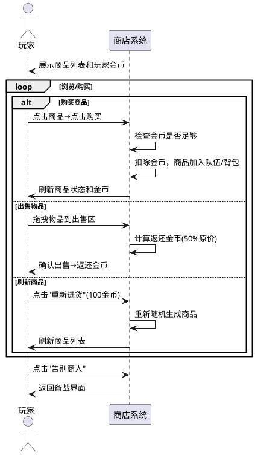

### 5.8.3 异常场景

1. **金币不足购买**

   a. 触发条件：玩家金币低于商品价格
   
   b. 系统行为：购买按钮禁用
   
   c. 用户感知：提示"囊中羞涩，先去赚点盘缠吧"

2. **金币不足刷新**

   a. 触发条件：玩家金币低于100
   
   b. 系统行为：刷新按钮禁用
   
   c. 用户感知：提示"囊中羞涩，先去赚点盘缠吧"

---

## 5.9 关卡推进系统

### 5.9.1 业务规则

1. **回合类型分配规则**：每章20回合的类型分配为：回合1-4普通、回合5遗物、回合6-9普通、回合10商店、回合11-13普通、回合14遗物、回合15-16普通、回合17商店、回合18-19普通、回合20Boss。

   a. 验收条件：[查看第1回合] → [类型=普通战斗]
   b. 验收条件：[查看第5回合] → [类型=遗物战斗]
   c. 验收条件：[查看第10回合] → [类型=商店战斗]
   d. 验收条件：[查看第20回合] → [类型=Boss战]

2. **回合推进规则**：每完成1次战斗（无论胜败），回合号+1。失败时提供"重新开始"选项，不推进回合。

   a. 验收条件：[第5回合战斗胜利] → [回合推进至第6回合]

3. **难度曲线规则**：回合内难度应当随回合号递增。回合1-5难度倍数1.0-1.1，回合6-10为1.1-1.2，回合11-15为1.2-1.4，回合16-19为1.4-1.6，回合20(Boss)为1.5-2.0。

   a. 验收条件：[第1回合敌方属性] → [应用难度倍数≈1.0]
   b. 验收条件：[第20回合Boss属性] → [应用难度倍数≈1.5~2.0]

4. **Demo章节限制规则**：Demo版本仅实现第一章"凡间"，通关第20回合Boss后显示通关界面。

   a. 验收条件：[第20回合Boss战胜利] → [显示"恭喜通关凡间！Demo版到此结束"]

5. **关卡进度展示规则**：备战界面应当展示当前回合号/总回合数，以及回合20时显示Boss预警。

   a. 验收条件：[当前回合=19] → [进度显示"19/20"，Boss预警"天劫将至！"]

### 5.9.2 交互流程

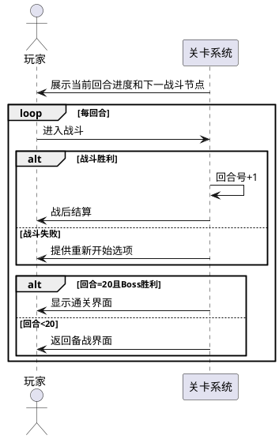

### 5.9.3 异常场景

1. **Boss战失败**

   a. 触发条件：第20回合Boss战失败
   
   b. 系统行为：显示失败界面，提供"重新挑战Boss"选项（保留当前阵容）
   
   c. 用户感知：可选择重新挑战或重新开始整局

---

## 5.10 死亡与复活系统

### 5.10.1 业务规则

1. **单位死亡规则**：当单位在战斗中HP降为0时，应当标记为死亡，从战场移除，进入复活倒计时（默认4回合）。

   a. 验收条件：[单位HP降为0] → [单位标记死亡，复活倒计时=4]

2. **复活倒计时递减规则**：每完成1次战斗（战后），所有死亡单位的复活倒计时-1。

   a. 验收条件：[单位复活倒计时=3，完成1次战斗] → [复活倒计时变为2]

3. **复活规则**：当复活倒计时降为0时，单位复活，恢复50%最大生命值，可正常参战。

   a. 验收条件：[单位复活倒计时=1，完成1次战斗] → [倒计时降为0，单位复活，HP=50%最大生命值]

4. **法宝加速复活规则**：拥有"替身傀儡"法宝的单位死亡时，应当立即复活（跳过倒计时），恢复50%生命值，每场战斗限1次。

   a. 验收条件：[装备"替身傀儡"的单位死亡] → [立即复活，HP=50%最大生命值，该场战斗后续死亡不再触发]

### 5.10.2 交互流程

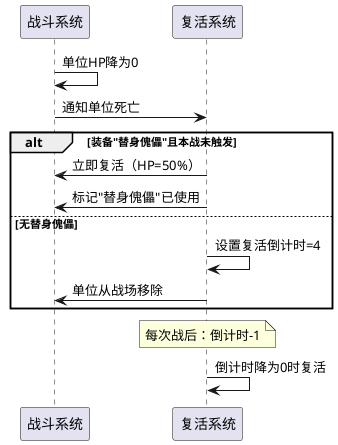

### 5.10.3 异常场景

1. **全部单位阵亡无法复活**

   a. 触发条件：所有单位死亡且复活倒计时均>0
   
   b. 系统行为：战斗立即判定失败
   
   c. 用户感知：显示"战斗失败"

---

## 5.11 主界面与游戏流程

### 5.11.1 业务规则

1. **主界面展示规则**：游戏启动后应当展示主界面，包含游戏Logo"万修列阵"、"开始修行"按钮、版本号v0.1(Demo)。

   a. 验收条件：[游戏启动] → [显示主界面，包含Logo、"开始修行"按钮、版本号]

2. **游戏流程规则**：完整游戏流程应当为：主界面→开局→备战→战斗→结算→备战→...→Boss战→通关/失败。

   a. 验收条件：[从主界面开始新游戏] → [依次经历开局→备战→战斗→结算的循环，直至Boss战结束]

3. **重新开始规则**：游戏失败或通关后，玩家可以选择"重新开始"，清空所有进度回到主界面。

   a. 验收条件：[玩家点击"重新开始"] → [清空当前游戏所有状态，回到主界面]

4. **国风视觉风格规则**：界面整体应当呈现国风/修仙视觉风格，包括：国风配色（墨色、朱红、金色为主）、毛笔字体或国风字体、国风边框/纹饰装饰。

   a. 验收条件：[查看任意界面] → [界面使用墨色/朱红/金色配色，国风装饰元素]

### 5.11.2 交互流程

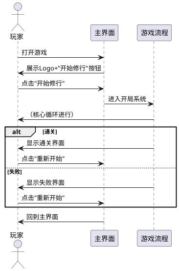

### 5.11.3 异常场景

1. **游戏状态丢失**

   a. 触发条件：浏览器刷新或意外关闭
   
   b. 系统行为：游戏状态丢失，需重新开始
   
   c. 用户感知：重新打开后回到主界面（Demo不支持存档）

---

# 6. 数据约束

## 6.1 我方单位（完整版，27种）

Demo应当实现策划文档中全部27种我方单位，覆盖4个等阶和7种流派：

1. **普通等阶（白）**：琴修弟子（法师流）、凡人修士（法师流）、武僧（战士流）、体修弟子（坦克流）、医修弟子（辅助流）、石工傀儡（坦克流）、毒修弟子（法师流）、雷修弟子（法师流）、灵植夫（辅助流）、商会修士（辅助流）、阴魂（召唤流）、僵尸（召唤流）
2. **稀少等阶（绿）**：剑修弟子（战士流）、炼尸修士（召唤流）、将帅修士（控制流）、鬼修弟子（控制流）、掌门弟子（辅助流）、丹修弟子（辅助流）、鬼道修士（召唤流）、刺客修士（刺客流）、阵法修士（坦克流）、血修弟子（战士流）、狂战士（战士流）、巫修弟子（法师流）
3. **传奇等阶（紫）**：道修弟子（辅助流）、剑仙弟子（战士流）、法修弟子（法师流）
4. **神话等阶（橙，限1）**：刑天（狂战士流）、女娲石灵（辅助流）

**属性约束**：每个单位必须包含HP、maxHp、攻击、防御、攻速(秒)、移速、射程、暴击率、暴击伤害、闪避率、韧性共11项属性，属性值应当与策划文档中的数值表一致。

**等阶约束**：普通等阶属性×1.0，稀少等阶×2.0，传奇等阶×4.0，神话等阶×8.0。

**阶数约束**：v1.1取消合成系统，所有单位固定为1阶，无升阶机制。

## 6.2 敌方单位（完整版，35种）

Demo应当实现策划文档中全部35种敌方单位，覆盖普通杂兵、精英怪、Boss三种类型：

1. **普通杂兵**（20种）：毒蜂、巨型毒蜂、山魅、风狸、狮妖、雌狮妖、墨豹妖、刃齿虎妖、虎妖、雁妖、小野鸭妖、鸭身马面兽、猪妖、羊妖、鹅妖、山魈、钻背山魈、熊妖、蜜獾妖、马妖
2. **精英怪**（约5种）：银背山魈、狼王、骏妖、独角兽妖、熊猫妖（视敌人类型标注而定）
3. **Boss**（5种+特殊）：马身鸭头兽（第一章Boss）、北极熊妖、羊力大仙、顽童、僵尸熊等（根据策划数值表中的Boss/精英标记）

**属性约束**：属性项同我方单位，数值应当与策划文档中的敌方数值表一致。

**难度约束**：敌方属性应当根据难度倍数动态调整。难度倍数=循环间倍数×循环内倍数，Demo中循环间倍数固定为1.0（仅1章）。

## 6.3 法宝（完整版，213种）

Demo应当实现策划文档中全部213个法宝，覆盖四大类型和四品质：

1. **进攻类**（约60个）：包含番天印(紫)、照妖镜(绿)、魔音笛(绿)、剥灵钳(绿)、探毒针(绿)、万法通识(橙)、百宝囊(绿)等
2. **防御类**（约50个）：包含八卦紫绶衣(紫)、护目镜(绿)、闪光马甲(绿)、护体戒指(紫)、铁头靴(绿)、金刚圈(绿)等
3. **功能类**（约53个）：包含替身傀儡(紫)、召回符(绿)、折扣符(绿)、应急戒指(紫)、扩音铃(绿)、清泉露(绿)等
4. **特殊机制类**（约50个）：包含灾劫日历(绿)、圣道徽(橙)、断路器(橙)、导灵体(绿)、慈悲为怀(绿)、事后诸葛(绿)等

**法宝子类型**：法宝(140个)、装备(30个)、符箓(16个)、丹药(13个)、心法(11个)、事件/特殊(3个)

**法宝属性约束**：每个法宝必须包含：编号、名称、类型、品质、效果描述、获取途径、价格。

**品质颜色约束**：普通=白、稀少=绿、传奇=紫、神话=橙。

**品质数量分布**：普通约64个、稀少约64个、传奇约64个、神话约21个。

**获取途径分布**：精英战必掉101个、商店购买49个、Boss战奖励34个、事件选择20个、普通战斗掉落7个、章节结算奖励2个。

## 6.4 关卡配置（Demo，1章×20回合）

1. **章节数量**：Demo仅实现1章（第一章"凡间"），共20回合
2. **回合类型分配**：回合1-4普通、5遗物、6-9普通、10商店、11-13普通、14遗物、15-16普通、17商店、18-19普通、20Boss
3. **敌方数量基准**：5 + floor(回合号/5)，加随机(-1~2)
4. **Boss配置**：第20回合Boss为"马身鸭头兽"，+10个小兵

## 6.5 经济约束

1. **金币上限**：9999
2. **灵石初始值**：200
3. **金币初始值**：0
4. **普通战斗奖励**：50-100金币
5. **遗物战斗奖励**：80-120金币
6. **商店战斗奖励**：100-150金币
7. **Boss战奖励**：300-500金币
8. **单位价格**：普通100、稀少300、传奇1000
9. **商店刷新费用**：100金币
10. **出售返还比例**：50%购买价格
11. **开局重新随机费用**：100灵石
12. **开局重新随机次数上限**：3次

## 6.6 战斗公式约束

1. **伤害公式**：伤害 = Max(1, (攻击方.攻击 - 防御方.防御 × 防御系数) × 技能系数 × 随机波动 × 暴击倍数)
2. **防御系数**：0.8
3. **随机波动范围**：0.9~1.1
4. **默认暴击伤害倍数**：2.0
5. **我方单位数量上限**：20
6. **默认复活倒计时**：4回合
7. **复活后生命值比例**：50%

## 6.7 待机区域约束

1. **待机区域尺寸**：应占据备战界面中央主展示区域，最小尺寸不小于界面宽度的60%×高度的50%
2. **单位行走速度**：待机区域内单位移速为战斗移速的30%-50%（营造闲逛感）
3. **行走停留时间**：单位到达目标点后停留1-3秒（随机）再选择新目标
4. **单位避让间距**：两个单位间保持至少30像素间距
5. **待机区域边界**：单位行走不可超出待机区域边界

---

# 7. Demo范围说明

## 7.1 实现范围（P0 - 核心必做）

| 功能 | 优先级 | 说明 |
|------|--------|------|
| 主界面 | P0 | 游戏入口，国风视觉 |
| 开局系统 | P0 | 随机开局单位+重新随机 |
| 备战界面 | P0 | 核心交互界面，展示单位/法宝/战斗节点 |
| 待机区域 | P0 | 单位待机展示+随机行走 |
| 单位折叠显示 | P0 | 同种单位合并为"名称×N"格式 |
| 自动战斗系统 | P0 | 核心玩法，双方自动交战 |
| 伤害计算 | P0 | 含暴击/闪避的完整伤害公式 |
| 战后结算 | P0 | 奖励展示+3选1唯一招募 |
| 法宝装备/卸下 | P0 | 核心构筑玩法 |
| 商店系统 | P0 | 购买/出售/刷新 |
| 关卡推进 | P0 | 20回合+Boss战 |

## 7.2 裁剪范围（Demo不实现）

| 功能 | 原因 | 替代方案 |
|------|------|----------|
| 合成系统(3合1/5合2) | v1.1取消 | 单位不再通过合成升级，固定1阶 |
| 多章节推进(2-9章) | Demo范围限制 | 仅实现第1章"凡间" |
| 道具系统 | 非核心循环 | 战斗中无道具使用 |
| 事件节点系统 | 非核心循环 | 回合类型中移除事件节点 |
| 局外解锁/成长 | Demo单次游玩 | 无多局累积 |
| 存档/读档 | Demo简化 | 浏览器刷新即重置 |
| 多难度层级 | Demo简化 | 仅"普通"难度 |
| 音效/BGM | Demo可选扩展 | 静音版本，可后续扩展 |
| 战斗中道具使用 | 道具系统裁剪 | 战斗中仅调速/暂停 |
| 地形/天气效果 | 非核心 | 战场无地形/天气 |
| 单位特殊AI(走位/躲避) | 实现复杂度高 | 所用单位使用简单AI（寻路+攻击最近敌人） |
| 单位技能系统(主动技能) | 实现复杂度高 | Demo中单位仅普攻，法宝提供被动效果 |
| 逃跑机制 | 非核心 | 战斗中仅暂停/继续 |

## 7.3 技术约束

1. **技术栈**：纯HTML + CSS + JavaScript，单文件或少量文件
2. **无依赖**：不依赖第三方游戏引擎或框架（如Phaser、PixiJS等）
3. **渲染方式**：使用HTML DOM + CSS动画 或 Canvas 2D 进行战场渲染
4. **运行环境**：直接在浏览器中打开HTML文件即可运行
5. **文件大小**：单文件总大小应当控制在2MB以内（含内嵌的完整27种单位+35种敌人+213个法宝数据）
